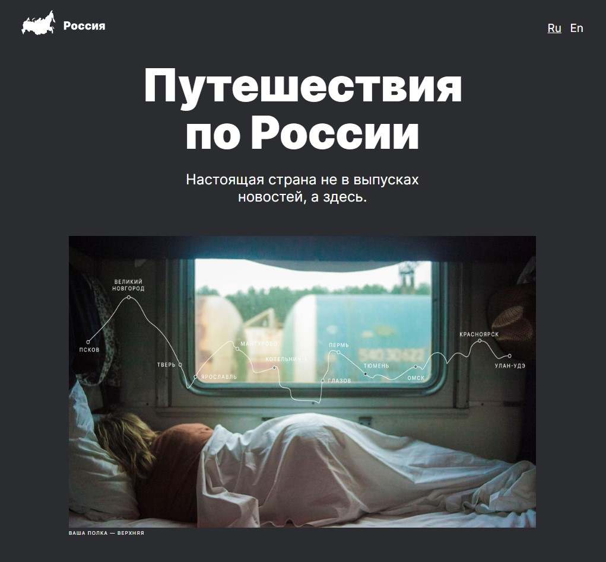

# Проект: Путешествие по России

### Обзор

- Интро
- Figma
- Картинки

**Интро**

В проекте использовалось: БЭМ-методология, Flexbox, Grid, Адаптивная вёрстка.

- [ссылка на проект о путешествии по России.](https://maxim-perepletchikov.github.io/russian-travel/)

**Figma**

- [Ссылка на макет в Figma](https://www.figma.com/file/5S2WSbEFL6awjVWJ0NWL8Q/Sprint-3_-Russia-_-desktop-mobile?node-id=28503%3A0)

**Картинки**

